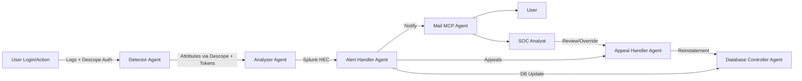

# 🔐 Z3r0Trust – Trust Me, Always Verified

Z3r0Trust is an autonomous multi-agent security framework powered by Descope to safeguard enterprise systems against modern cyber threats. It continuously authenticates, detects, analyzes, responds, and manages suspicious activities — while ensuring transparency, fairness and SOC oversight.

Unlike traditional SIEMs that only record events, Z3r0Trust combines Descope-based authentication & delegation, real-time log intelligence, autonomous response and human appeal workflows to create a resilient defense ecosystem.

Descope acts as a middleware security layer for third-party applications, protecting them from brute force, credential stuffing, suspicious API usage, and more. Any third-party application integrating with Z3r0Trust creates a proxy URL that routes backend traffic through Z3r0Trust middleware. This ensures logs are captured, anomalies are detected, and malicious actors are blocked automatically.

---

## 📛 Project Info

**Project Name:** Z3r0Trust – Trust Me, Always Verified  
**Short Description:** An AI-driven, multi-agent framework leveraging **Descope OAuth** for secure inter-agent communication, autonomous detection/response, and fair user management.

## 👥 Team – Sentinel 5

We are **Sentinel 5**, a passionate team of developers and security innovators dedicated to building resilient, human-centric cyber defense systems. Our expertise spans **full-stack development, cybersecurity, machine learning, DevOps, cloud computing, and UI/UX design**, enabling us to deliver scalable end-to-end solutions.

**Team Members:**

* [Rohit Vijayan B](https://www.linkedin.com/in/rohitvijayan1111/)
* [Divakar G](https://www.linkedin.com/in/divakar3501/)
* [Rithik Raja S](https://www.linkedin.com/in/rithik-raja-s/)
* [Gokul J](https://www.linkedin.com/in/gokul-jeyachandran-37a649229/)
* [Kaviyarasu S](https://www.linkedin.com/in/kaviyarasu-sivaraj-312893262/)

---

## 🎯 Hackathon Theme / Challenge Addressed

**Theme 3:** Secure agent-to-agent communication with Descope
**Theme:** Design How Agents Talk, Trust, and Team Up
**Level:** Advanced

**Challenges:**

* Build a secure, multi-agent system where autonomous agents communicate across trust boundaries.
* Include at least two agents with distinct scopes/roles.
* Use **Descope** as the identity and access management layer for all agent communication.
* Enforce **OAuth-based scoped access and delegated trust**.
* Capture and replay **user consent** if agents operate on behalf of users.
* Secure exposed APIs via **Descope Inbound Apps**.

---

## 📌 Problem

Enterprises face persistent challenges:

* *Credential theft and phishing* are leading attack vectors.
* *SOC teams are overwhelmed* by noisy or repetitive alerts.
* *Slow response times* due to manual triage.
* *Legitimate users often get blocked* unfairly without recourse.

**Logs alone are not enough.**
Z3r0Trust transforms raw events into *actionable security outcomes* with *autonomous containment and fair user handling*.

---

## 🏗 Solution

Z3r0Trust introduces a *coordinated system of specialized agents*, each with a clear responsibility. All inter-agent communication is secured via **Descope OAuth tokens** with scoped access, ensuring strict trust boundaries.

**Third-party integration flow:**

* The 3rd-party app integrates with Z3r0Trust by creating a **proxy URL** inside Z3r0Trust.
* All traffic flows through this middleware, where **Descope** authenticates and validates user attributes.
* Logs are captured, anomalies detected, and malicious users are automatically blocked while legitimate access continues.

### Guidelines Alignment

* ✅ Z3r0Trust's agents with clearly defined roles interact using the access tokens generated by **Descope**, ensuring secure and trusted communication.
* ✅ Descope used for all token generation, validation, and delegation.
* ✅ Scope restrictions enforced on all protected endpoints.
* ✅ Delegation demonstrated when one agent acts on behalf of another (e.g., Mail Agent handling alerts).
* ✅ Descope Flows applied for user-facing consent (e.g., MFA, appeal approvals).

---

### With & Without Z3r0Trust


### Key Features

* 🔑 Authentication & validation via **Descope OAuth**
* 📡 **Splunk real-time analytics** with anomaly detection
* 🤖 **AI-powered log summarization** for SOC teams (less noise, faster context)
* ⚡ Automated response: block, suspend, or monitor
* 📬 Tiered email notifications: concise for users, forensic for SOC
* 🧑‍💼 Human oversight through a **SOC dashboard**
* 📝 Transparent appeal system for reinstatements
* 📜 Immutable audit trails for compliance

---

## 🏗 Architecture



---

## 🏗 Systematic Work Flow


## 🤖 Agents

### 🔍 Detector Agent

* Authenticates with **Descope**.
* Retrieves user attributes (IP, device, geo, MFA status).
* Validates logins and flags anomalies.
* Forwards enriched logs to **Splunk**.

### 📊 Analyser Agent

* Receives logs from Detector Agent.
* Sends data to **Splunk** for real-time processing.
* Splunk processes in 3 tiers:
  * **High Frequency (5 mins):** Brute force, credential stuffing, suspicious API usage, bot/malware.
  * **Medium Frequency (30 mins):** Impossible travel, account takeover, privilege escalation.
  * **Low Frequency (5 hrs):** Data exfiltration, insider abuse, network anomalies.
* Maintains **MD5 hash cache** (alert\_name.username.ip.device) to prevent duplicate alerts.
* Forwards validated anomalies to Alert Handler Agent.

### 🚨 Alert Handler Agent

* Processes alert data.
* Decides on appropriate action:
  * Temporary/Permanent block
  * User logout or session invalidation
  * Enforce MFA
* Coordinates with Mail Sender, Database Controller, and Appeal Handler.
* Creates **appeal tickets** in DB.

### 📧 Mail Sender Agent

* Handles outbound email notifications.
* Pre-configured with secure sender ID and app passkey.
* Use cases:
  * Alert user of suspicious activity.
  * Notify SOC with forensic details.
  * Confirm appeal submission.
  * Notify user of account reinstatement.

### 🗄 Database Controller Agent

* Securely interfaces with the database under scoped privileges.
* Only executes *traceable and recoverable* operations.
* Acts as a delegate to SOC for safe query execution.

### 📝 Appeal Handler Agent

* Activated when a user submits an appeal.
* Reviews alert data + user message.
* If low risk, reinstates account autonomously.
* If uncertain, escalates to **SOC Analyst**.
* Updates DB and notifies user via Mail Sender.

➡️ The last four agents (Alert Handler, Mail Sender, Database Controller, and Appeal Handler) communicate among themselves using secure access keys. If any third-party tries to access them without proper authorization, they are blocked instantly based on **Descope access key authentication**.

---

## 📂 Example Work Flow (Scenario Based)

**Scenario:** Multiple failed logins → sudden success from a new device in Moscow.

1. **Detector** authenticates login via **Descope OAuth**, retrieves attributes, and sends enriched logs to Splunk.
2. **Analyser** correlates with Splunk, scores risk as High.
3. **Alert Handler** suspends account, updates Alerts DB.
4. **Mail MCP Agent** sends:

   * ✉ User-friendly alert to employee
   * 📑 SOC email with forensic details
5. **SOC Analyst** validates the suspension.
6. **Appeal Agent** reviews employee’s appeal, reinstates if legitimate.

➡ Threat contained instantly  
➡ SOC informed with summarized context  
➡ User treated fairly with transparent process  
➡ Full **Descope-based trust validation** ensured

---

## ⚙️ What We Built + How to Run It

Z3r0Trust is a **multi-agent security system** powered by **Descope** and **Splunk**.

### Core Workflow

* **Detector Agent**: Validates sessions via Descope, enriches data, forwards to Splunk.
* **Analyser Agent**: Performs correlation, risk scoring.
* **Alert Handler Agent**: Takes enforcement actions (block/logout/MFA).
* **Mail Agent**: Notifies users + SOC.
* **Appeal Agent**: Provides human fairness and consent-based reinstatements.
  
---
## 🚀 Z3r0Trust - Setup & Run Guide

This guide explains how to set up and run the Z3r0Trust project step by step.

📦 Prerequisites

    -> Python 3.10+
    
    -> Node.js (>=18.x) + npm
    
    -> pip (Python package manager)
    
    -> A Gmail App Password (for email sending)

    -> Splunk Enterprise
    
    -> A Descope account (for authentication & management keys)

⚙️ Environment Variables


1️⃣ Clone the Repository
```
git clone https://github.com/rohitvijayan1111/Z3r0Trust/
cd Z3r0Trust/Agent
```
Create a .env file inside Z3r0Trust/Agent folder with the following:
```
# API Keys
PHI_API_KEY=your_phi_api_key
GROQ_API_KEY=your_groq_api_key
GMAIL_PASSKEY=your_gmail_app_password
DESCOPE_MANAGEMENT_KEY=your_descope_management_key
DESCOPE_PROJECT_ID=your_descope_project_id

# Agent Access Keys (for secure internal communication)
EMAIL_SENDER_AGENT_ACCESS_KEY=your_email_sender_access_key
ALERT_HANDLER_AGENT_ACCESS_KEY=your_alert_handler_access_key
DB_CONTROLLER_AGENT_ACCESS_KEY=your_db_controller_access_key
APPEAL_HANDLER_AGENT_ACCESS_KEY=your_appeal_handler_access_key

# Models and Services
GROQ_MODEL_1=llama-3.1-70b-versatile   # or any supported model
IP_AND_PORT_1=http://localhost:2222
IP_AND_PORT_2=http://localhost:5000

```
⚠️ Never commit .env to GitHub. It’s already added to .gitignore.


2️⃣ Run the Agent Service
```
pip install -r requirements.txt
python app.py
```
3️⃣ Run the Z3r0Trust - Backend
```
cd ../backend
pip install -r requirements.txt
python app.py
```
4️⃣ Run the Z3r0Trust - Frontend
```
cd ../frontend/zero-trust
npm install
npm run dev
```
5️⃣ Run the Third Party Application (Bank Management App)
```
cd ../Bank
npm install
npm run dev
```
    Login Credentials (Bank Management App)
      Login Id: diva22022.it@rmkec.ac.in
      Password: 123qwe!@#QWE

6️⃣ Bank - Backend ( Z3r0Trust works as Middleware using descope)
```
cd ../Bank/backend
venv\Scripts\activate
pip install -r requirements.txt
uvicorn main:app --reload --port 4000
```
7️⃣ Splunk - Analyzer Agent Working
```
start the splunk enterprise application from start menu
splunk server will start in server URL = 127.0.0.1:8001
Create an index called ZeroTrust logs to save the logs from the detector agent
Configure alerts going into search and reporting, paste the SPL query in it and save it , name the alert, configure CRON job according to the frequency of the threat and set trigger to webhook and paste the url of the Agent's backend service.
SPL queries of various threats - 
```

The frontend will be available at:
```
👉 http://localhost:5173
```

✅ Notes

Agents communicate securely using the access keys defined in .env.

Ensure all services (Agent, Backend, Frontend) are running simultaneously.

Use Gmail App Password (not your Gmail login password).

Update .env values with actual keys from Descope and Groq.

---

## 🛠 Tech Stack

* **Auth & Trust** – Descope Console (OAuth, Flows, Scoped Tokens)
* **Backend Agents** – Python backend(FastAPI, Flask), MCP and FastMCP, Phidata Agents and Tools
* **Log Analytics** – Splunk (SPL, HEC)
* **Frontend Dashboard** – React
* **Database** – MySQL
* **Email Service** – GROQ-based templating
* **Cloud Services** – Google Console
---

## 🎥 Demo Video

📺 \[Insert Demo Video Link Here]

---
## 📸 Snapshots

Descope Inbound Apps:


Deploment Details:


## 🎥 PPT Link

📺 [PPT Link](https://drive.google.com/file/d/1fYZRbzq2pA29tYjK-mGMvCXn1-LyPcj_/view?usp=sharing)


## 🔮 Future Advancements (What We’d Do With More Time)

* 🚀 Extend adaptive **machine learning models** for advanced anomaly detection.
* 🔗 Correlate **multi-vector incidents** (e.g., brute force + privilege escalation).
* 🚀 upgrade the MVP to Production ready app 

---

## 📊 Impact

Z3r0Trust is built to be both **technically robust** and **human-centric**:

* Reduces breach risk while lowering SOC fatigue
* Balances automation with fairness via multi-agent autonomy
* Ensures **security-by-design** with scoped Descope tokens and access boundaries
* Demonstrates strong technical execution with **Splunk, Descope, FastAPI, React**
* Maintains **connectivity and reliability** through secure APIs and real-time updates

⚡ Currently, Z3r0Trust represents a **Minimal Viable Product (MVP)** – a foundational yet functional system that proves the effectiveness of Descope-secured multi-agent workflows while leaving space for future scaling.

---

## 📧 Contact

**Team Sentinel 5**


