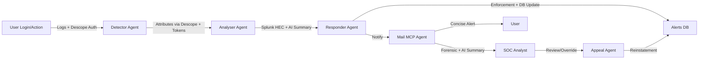

# 🔐 Z3r0Trust – Autonomous Security, Human Trust

Z3r0Trust is an **autonomous multi-agent security framework powered by Descope** to safeguard enterprise systems against modern cyber threats. It continuously detects, analyzes, responds, and manages suspicious activities — while ensuring transparency, fairness, and SOC oversight.

Unlike traditional SIEMs that only record events, Z3r0Trust combines **Descope-based authentication and delegation, real-time log intelligence, autonomous response, AI-driven summaries, and human appeal workflows** to create a resilient defense ecosystem.

---

## 📛 Project Info

**Project Name:** Z3r0Trust – Autonomous Security, Human Trust
**Short Description:** An AI-driven, multi-agent framework leveraging **Descope OAuth** for secure inter-agent communication, autonomous detection/response, and fair user management.

**Team Name:** united visionaries
**Team Members:** Sample placeholders (replace with actual names)

* Team 1: Member A, Member B
* Team 2: Member C, Member D
* Team 3: Member E, Member F
* Team 4: Member G, Member H
* Team 5: Member I, Member J

---

## 🎯 Hackathon Theme / Challenge Addressed

**Theme 3:** Secure agent-to-agent communication with Descope
**Theme:** Design How Agents Talk, Trust, and Team Up
**Level:** Advanced

**Challenges:**

* Build a secure, multi-agent system where autonomous agents communicate across trust boundaries.
* Include at least two agents with distinct scopes/roles.
* Use **Descope** as the identity and access management layer for all agent communication.
* Enforce **OAuth-based scoped access and delegated trust**.
* Capture and replay **user consent** if agents operate on behalf of users.
* Secure exposed APIs via **Descope Inbound Apps**.

---

## 📌 Problem

Enterprises still face persistent challenges:

* **Credential theft and phishing** remain top attack vectors.
* **SOC teams are overwhelmed** by repetitive or noisy alerts.
* **Response times lag** because incidents require manual triage.
* **Legitimate users are unfairly blocked**, often without recourse.

⚠️ Logs alone are not enough.

Z3r0Trust transforms raw events into **actionable security outcomes** with **autonomous containment, Descope-driven trust validation, and fair user handling**.

---

## 🏗 Solution

Z3r0Trust introduces a **coordinated system of specialized agents**, each with a clear responsibility. They communicate securely using **Descope OAuth tokens** to enforce trust boundaries, validate user sessions, and delegate actions across the system.

### Guidelines Alignment

* ✅ At least two agents with clearly defined roles interacting over secure APIs.
* ✅ Descope used for all token generation, validation, and delegation.
* ✅ Scope restrictions enforced on all protected endpoints.
* ✅ Delegation demonstrated when one agent acts on behalf of another (e.g., Responder → Mail Agent).
* ✅ Descope Flows applied for user-facing consent (e.g., MFA, appeal approvals).

### Key Features

* 🔑 **Authentication & validation via Descope OAuth**
* 📡 **Splunk real-time analytics** with anomaly detection
* 🤖 **AI-powered log summarization** for SOC teams
* ⚡ Automated response: block, suspend, or monitor
* 📬 Tiered email notifications: concise for users, forensic for SOC
* 🧑‍💼 Human oversight through a **SOC dashboard**
* 📝 Transparent appeal system for fair reinstatements
* 📜 Immutable audit trails for compliance

---

## 🏗 Architecture

---

## 🤖 Agents

| Agent                 | Role                                                                                                     |
| --------------------- | -------------------------------------------------------------------------------------------------------- |
| **Detector**          | Authenticates with Descope, fetches user attributes (geo, IP, device), forwards enriched logs to Splunk. |
| **Analyser**          | Splunk correlation, risk scoring, AI summarization of logs.                                              |
| **Responder**         | Validates alerts, updates DB, applies enforcement actions.                                               |
| **Mail MCP Agent**    | Sends structured alerts: user-friendly emails + SOC forensic reports                                     |
| **SOC Analyst Layer** | Dashboard for reviewing medium/low-confidence alerts.                                                    |
| **Appeal Agent**      | Manages user appeals, cross-checks evidence, reinstates if justified.                                    |

---

## 📂 Work Flow

**Scenario:** Multiple failed logins → sudden success from a new device in Moscow.

1. **Detector** authenticates login via **Descope OAuth**, retrieves attributes, and sends enriched logs to Splunk.
2. **Analyser** correlates with Splunk, scores risk as High.
3. **Responder** suspends account, updates Alerts DB.
4. **Mail MCP Agent** sends:

   * ✉ User-friendly alert to employee
   * 📑 SOC email with forensic details + AI log summary
5. **SOC Analyst** validates the suspension.
6. **Appeal Agent** reviews employee’s appeal, reinstates if legitimate.

✅ Threat contained instantly
✅ SOC informed with summarized context
✅ User treated fairly with transparent process
✅ Full **Descope-based trust validation** ensured

---

## ⚙️ What We Built + How to Run It

Z3r0Trust is a **multi-agent security system** powered by **Descope** and **Splunk**.

### Core Workflow

* **Detector Agent**: Validates sessions via Descope, enriches data, forwards to Splunk.
* **Analyser Agent**: Performs correlation, risk scoring, AI summarization.
* **Responder Agent**: Takes enforcement actions (block/logout/MFA).
* **Mail Agent**: Notifies users + SOC.
* **Appeal Agent**: Provides human fairness and consent-based reinstatements.

### Running the System

1. Configure **Descope console** with apps, scopes, and flows.
2. Deploy agents using **FastAPI/Flask** backend.
3. Connect Splunk via **HEC** for real-time log ingestion.
4. Run **React/Next.js dashboard** for SOC oversight.
5. Use **Google Console** for supporting cloud integrations.

---

## 🛠 Tech Stack

* **Auth & Trust** – Descope Console (OAuth, Flows, Scoped Tokens)
* **Backend Agents** – Python (FastAPI/Flask)
* **Log Analytics** – Splunk (SPL, HEC, AI summarization)
* **Frontend Dashboard** – React/Next.js
* **Database** – PostgreSQL / MongoDB
* **Email Service** – GROQ-based templating
* **Cloud Services** – Google Console

---

## 🎥 Demo Video

📺 \[Insert Demo Video Link Here]

---

## 🔮 Future Advancements (What We’d Do With More Time)

* 🚀 Extend adaptive **machine learning models** for advanced anomaly detection.
* 🔗 Correlate **multi-vector incidents** (e.g., brute force + privilege escalation).
* 🔒 Implement **end-to-end encrypted agent messaging**.
* ⏱ SLA-driven appeal resolution workflows for user fairness.
* 📊 Advanced predictive dashboards with proactive threat intelligence.
* 🌍 Multi-cloud integration for broader enterprise adoption.

---

## 📊 Impact

Z3r0Trust is built to be both **technically robust** and **human-centric**:

* Reduces breach risk while lowering SOC fatigue
* Balances automation with fairness via multi-agent autonomy
* Ensures **security-by-design** with scoped Descope tokens and access boundaries
* Demonstrates strong technical execution with **Splunk, Descope, FastAPI, React**
* Maintains **connectivity and reliability** through secure APIs and real-time updates

---

## 📧 Contact

**Team Z3r0Trust**
📩 [divakar3501@gmail.com](mailto:divakar3501@gmail.com)
