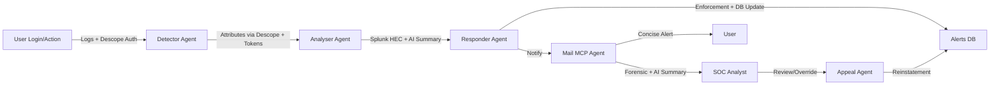

# 🔐 Z3r0Trust – Autonomous Security, Human Trust

Z3r0Trust is an autonomous multi-agent security framework powered by Descope to safeguard enterprise systems against modern cyber threats. It continuously authenticates, detects, analyzes, responds, and manages suspicious activities — while ensuring transparency, fairness and SOC oversight.

Unlike traditional SIEMs that only record events, Z3r0Trust combines Descope-based authentication & delegation, real-time log intelligence, autonomous response and human appeal workflows to create a resilient defense ecosystem.

Descope acts as a middleware security layer for third-party applications, protecting them from brute force, credential stuffing, suspicious API usage, and more. Any third-party application integrating with Z3r0Trust creates a proxy URL that routes backend traffic through Z3r0Trust middleware. This ensures logs are captured, anomalies are detected, and malicious actors are blocked automatically.

---

## 📛 Project Info

**Project Name:** Z3r0Trust – Autonomous Security, Human Trust
**Short Description:** An AI-driven, multi-agent framework leveraging **Descope OAuth** for secure inter-agent communication, autonomous detection/response, and fair user management.

## 👥 Team – Sentinel 5
We are **Sentinel 5**, a passionate team of developers and security innovators dedicated to building resilient, human-centric cyber defense systems. Our expertise spans **full-stack development, cybersecurity, machine learning, DevOps, cloud computing, and UI/UX design**, enabling us to deliver scalable end-to-end solutions.

**Team Members:** 

* [Rohit Vijayan B](https://www.linkedin.com/in/rohitvijayan1111/)
* [Divakar G](https://www.linkedin.com/in/divakar3501/)
* [Rithik Raja S](https://github.com/RithikRaja28)
* [Gokul J](https://github.com/GokulJeyachandran-1 )
* [Kaviyarasu S](https://www.linkedin.com/in/kaviyarasu-sivaraj-312893262/)

---

## 🎯 Hackathon Theme / Challenge Addressed

**Theme 3:** Secure agent-to-agent communication with Descope
**Theme:** Design How Agents Talk, Trust, and Team Up
**Level:** Advanced

**Challenges:**

* Build a secure, multi-agent system where autonomous agents communicate across trust boundaries.
* Include at least two agents with distinct scopes/roles.
* Use **Descope** as the identity and access management layer for all agent communication.
* Enforce **OAuth-based scoped access and delegated trust**.
* Capture and replay **user consent** if agents operate on behalf of users.
* Secure exposed APIs via **Descope Inbound Apps**.

---

## 📌 Problem

Enterprises face persistent challenges:

* *Credential theft and phishing* are leading attack vectors.
* *SOC teams are overwhelmed* by noisy or repetitive alerts.
* *Slow response times* due to manual triage.
* *Legitimate users often get blocked* unfairly without recourse.

**Logs alone are not enough.**
Z3r0Trust transforms raw events into *actionable security outcomes* with *autonomous containment and fair user handling*.

---

## 🏗 Solution

Z3r0Trust introduces a *coordinated system of specialized agents*, each with a clear responsibility. All inter-agent communication is secured via **Descope OAuth tokens** with scoped access, ensuring strict trust boundaries.

**Third-party integration flow:**

* The 3rd-party app integrates with Z3r0Trust by creating a **proxy URL** inside Z3r0Trust.
* All traffic flows through this middleware, where **Descope** authenticates and validates user attributes.
* Logs are captured, anomalies detected, and malicious users are automatically blocked while legitimate access continues.

### Guidelines Alignment

* ✅ At least two agents with clearly defined roles interacting over secure APIs.
* ✅ Descope used for all token generation, validation, and delegation.
* ✅ Scope restrictions enforced on all protected endpoints.
* ✅ Delegation demonstrated when one agent acts on behalf of another (e.g., Responder → Mail Agent).
* ✅ Descope Flows applied for user-facing consent (e.g., MFA, appeal approvals).

---

### With & Without Z3r0Trust

### Key Features

* 🔑 Authentication & validation via **Descope OAuth**
* 📡 **Splunk real-time analytics** with anomaly detection
* 🤖 **AI-powered log summarization** for SOC teams (less noise, faster context)
* ⚡ Automated response: block, suspend, or monitor
* 📬 Tiered email notifications: concise for users, forensic for SOC
* 🧑‍💼 Human oversight through a **SOC dashboard**
* 📝 Transparent appeal system for reinstatements
* 📜 Immutable audit trails for compliance

---

## 🏗 Architecture

---

## 🏗 Systematic Work Flow

## 🤖 Agents

### 🔍 Detector Agent

* Authenticates with **Descope**.
* Retrieves user attributes (IP, device, geo, MFA status).
* Validates logins and flags anomalies.
* Forwards enriched logs to **Splunk**.

### 📊 Analyser Agent

* Receives logs from Detector Agent.
* Sends data to **Splunk** for real-time processing.
* Splunk processes in 3 tiers:
  * **High Frequency (5 mins):** Brute force, credential stuffing, suspicious API usage, bot/malware.
  * **Medium Frequency (30 mins):** Impossible travel, account takeover, privilege escalation.
  * **Low Frequency (5 hrs):** Data exfiltration, insider abuse, network anomalies.
* Maintains **MD5 hash cache** (alert\_name.username.ip.device) to prevent duplicate alerts.
* Forwards validated anomalies to Responder Agent.
* 

### 📧 Mail Sender Agent

* Handles outbound email notifications.
* Pre-configured with secure sender ID and app passkey.
* Use cases:
  * Alert user of suspicious activity.
  * Notify SOC with forensic details.
  * Confirm appeal submission.
  * Notify user of account reinstatement.

### 🚨 Alert Handler Agent

* Processes alert data.
* Decides on appropriate action:
  * Temporary/Permanent block
  * User logout or session invalidation
  * Enforce MFA
* Coordinates with Mail Sender (to notify) and Database Controller (to log alerts).
* Creates **appeal tickets** in DB.

### 🗄 Database Controller Agent

* Securely interfaces with the database under scoped privileges.
* Only executes *traceable and recoverable* operations.
* Acts as a delegate to SOC for safe query execution.

### 📝 Appeal Handler Agent

* Activated when a user submits an appeal.
* Reviews alert data + user message.
* If low risk, reinstates account autonomously.
* If uncertain, escalates to **SOC Analyst**.
* Updates DB and notifies user via Mail Sender.

---

## 📂 Example Work Flow (Scenario Based)

**Scenario:** Multiple failed logins → sudden success from a new device in Moscow.

1. **Detector** authenticates login via **Descope OAuth**, retrieves attributes, and sends enriched logs to Splunk.
2. **Analyser** correlates with Splunk, scores risk as High.
3. **Responder** suspends account, updates Alerts DB.
4. **Mail MCP Agent** sends:

   * ✉ User-friendly alert to employee
   * 📑 SOC email with forensic details + AI log summary
5. **SOC Analyst** validates the suspension.
6. **Appeal Agent** reviews employee’s appeal, reinstates if legitimate.

✅ Threat contained instantly
✅ SOC informed with summarized context
✅ User treated fairly with transparent process
✅ Full **Descope-based trust validation** ensured

---

## ⚙️ What We Built + How to Run It

Z3r0Trust is a **multi-agent security system** powered by **Descope** and **Splunk**.

### Core Workflow

* **Detector Agent**: Validates sessions via Descope, enriches data, forwards to Splunk.
* **Analyser Agent**: Performs correlation, risk scoring, AI summarization.
* **Responder Agent**: Takes enforcement actions (block/logout/MFA).
* **Mail Agent**: Notifies users + SOC.
* **Appeal Agent**: Provides human fairness and consent-based reinstatements.

### Running the System

1. Configure **Descope console** with apps, scopes, and flows.
2. Deploy agents using **FastAPI/Flask** backend.
3. Connect Splunk via **HEC** for real-time log ingestion.
4. Run **React/Next.js dashboard** for SOC oversight.
5. Use **Google Console** for supporting cloud integrations.

---

## 🛠 Tech Stack

* **Auth & Trust** – Descope Console (OAuth, Flows, Scoped Tokens)
* **Backend Agents** – Python backend(FastAPI, Flask), MCP and FastMCP, Phidata Agents and Tools
* **Log Analytics** – Splunk (SPL, HEC, AI summarization)
* **Frontend Dashboard** – React
* **Database** – MySQL
* **Email Service** – GROQ-based templating
* **Cloud Services** – Google Console

---

## 🎥 Demo Video

📺 \[Insert Demo Video Link Here]

---

## 🎥 PPT Link
📺 https://registan-fergana.my.canva.site/z3r0-trust

---

## 🔮 Future Advancements (What We’d Do With More Time)

* 🚀 Extend adaptive **machine learning models** for advanced anomaly detection.
* 🔗 Correlate **multi-vector incidents** (e.g., brute force + privilege escalation).
* 🔒 Implement **end-to-end encrypted agent messaging**.
* ⏱ SLA-driven appeal resolution workflows for user fairness.
* 📊 Advanced predictive dashboards with proactive threat intelligence.
* 🌍 Multi-cloud integration for broader enterprise adoption.

---

## 📊 Impact

Z3r0Trust is built to be both **technically robust** and **human-centric**:

* Reduces breach risk while lowering SOC fatigue
* Balances automation with fairness via multi-agent autonomy
* Ensures **security-by-design** with scoped Descope tokens and access boundaries
* Demonstrates strong technical execution with **Splunk, Descope, FastAPI, React**
* Maintains **connectivity and reliability** through secure APIs and real-time updates

---

## 📧 Contact

**Team Sentinal 5**

